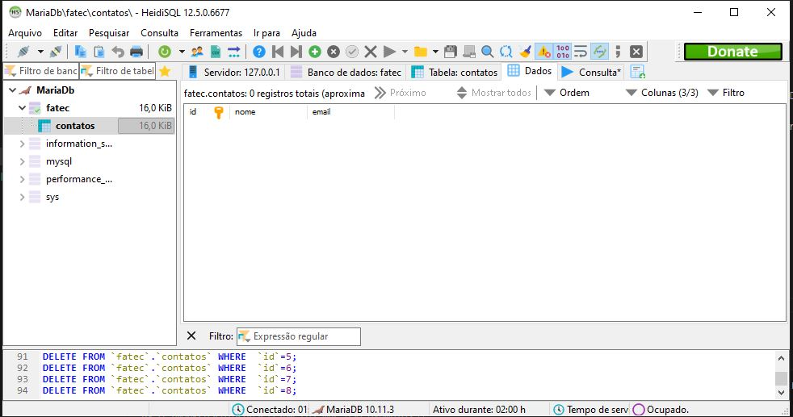
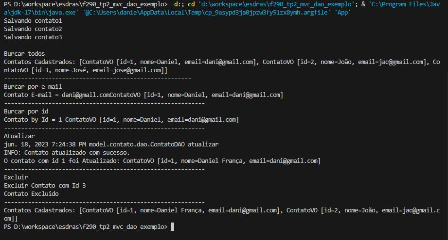
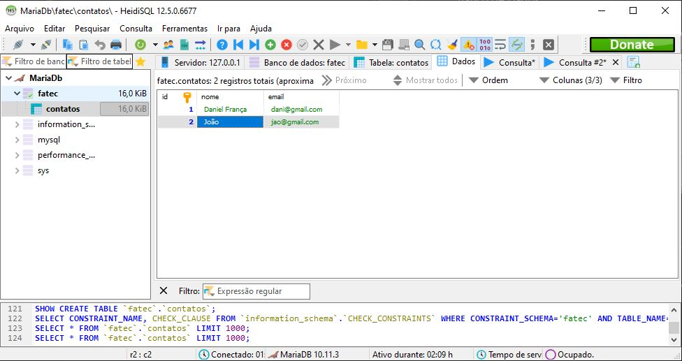

# Atividade DAO:

## Instruções
Para esta tividade iremos avançar nosso estudos na camada de dominio e finalizar a 
atividade concluindo o DAO Pattern combinando-o com a camada de serviços.

Para consluir a atividade voces devem tomar como base o repositorio em anexo e implementar os //TODO:s e os tópicos descritos a seguir:
Criar camada de serviços. A camada de serviços deverá acessar o DAO para realizar as operações sobre a base de dados.
A criação da camada de serviços irá possibilitar a utilização dos testes unitários;
Crie uma classe Playground e teste as operações disponibilizadas pela camada Service.
Materiais de referência

# Imagens após implementação:

### Banco de Dados:

Banco de dados MariaDB em Docker acessado pelo HeidiSQL Client

 

Após chamar a aplicação pelo App segue terminal:

 

Banco de dados ao final do processo:

